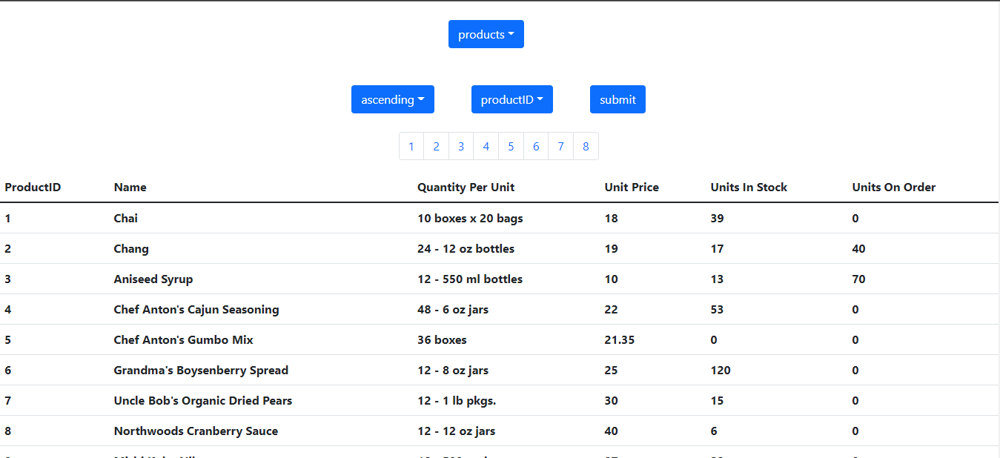

# Sql Query Editor

> This platform built with the ReactJs.
> This application is deployed here:- https://tranquil-crumble-22eb38.netlify.app

## Image



## Features

- Different Data Table
- Added multiple query options along with options for sorting the results
- In case of large number of rows in a table, I have added pagination so that the page loads smoothly and not crashed due to load

```

### Install Dependencies

```

npm install

```

### Run

```

# Run frontend (:3000)

npm start
